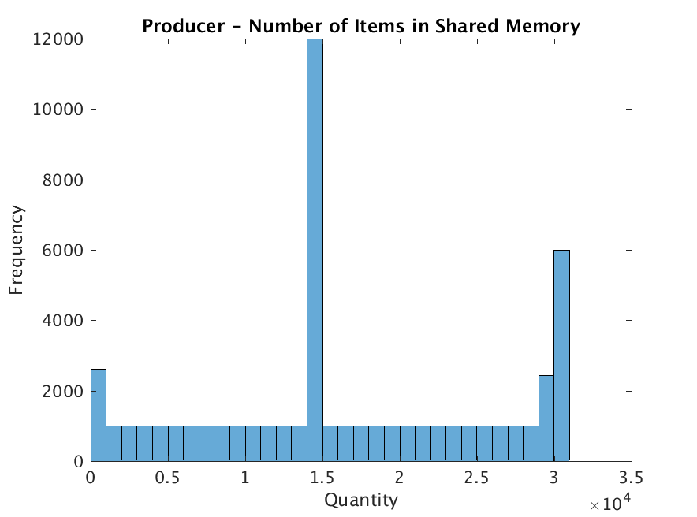
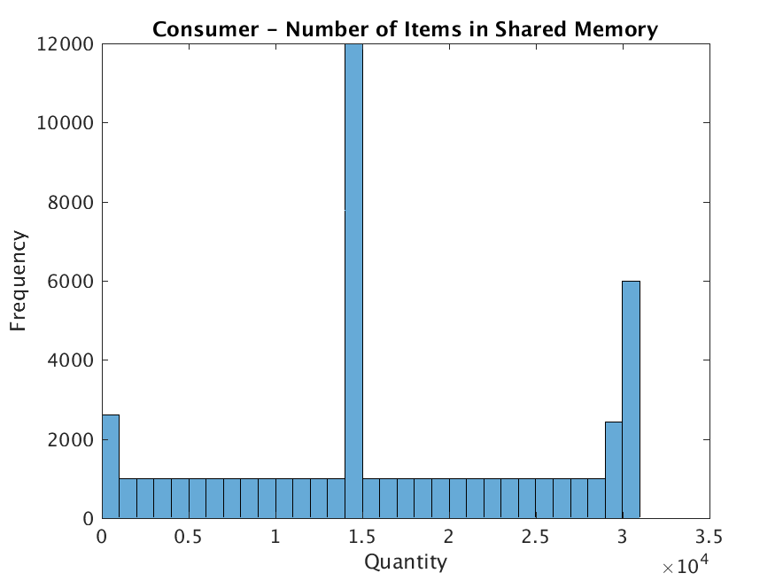
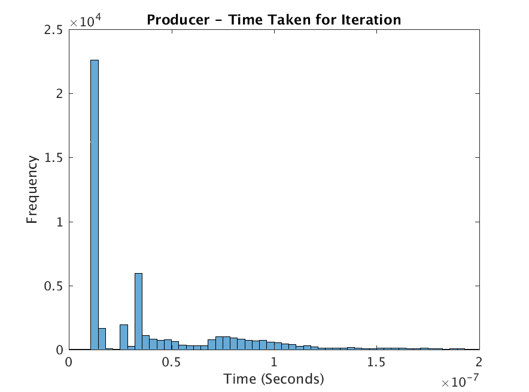
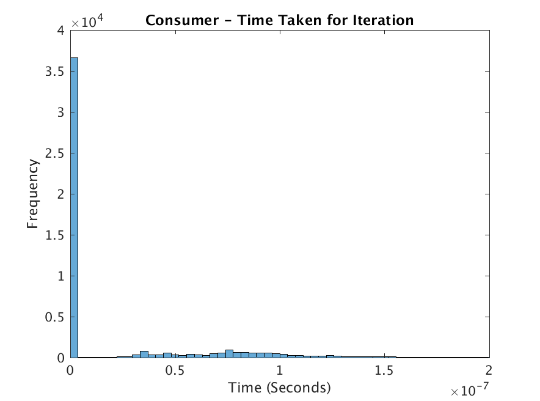

# Program 2 – Semaphores and Concurrency using Threads

The assignment was to write a producer/consumer program using threads. The producer generates or produces some data and the consumer uses it. We needed to add functionality to keep track of how many items were in the buffer at any given point, the time it took for the producer to add an item, and the time it took for the consumer to remove one. We were then supposed to use the data collected to study the concurrency mechanisms of the operating system. This process was supposed to give us an insight into what the operating system was doing on the program's behalf.

## Approach
For this experiment I am using Debian Linux running on a dual-core system. I used the ANSI C programming language for my design. My design consists of using semaphores for assuring mutual exclusion, regular allocated memory segment to share a buffer between the producer/consumer pair, and threads as a mechanism of creating two execution entities of the program. Anything that needed to be shared between the threads was stored in a global variable. An alternative would be to use static variables. The program uses this memory segment as an array and a semaphore to keep track of how many items are in the buffer at a given point. The producer thread generates a random number to simulate the process of producing and the consumer thread does a division operation to simulate the consuming this data. I programmed the buffer to much longer than the program would ever use (80,000 items long). I then programmed the producer to stop after inserting 50,000 items.

## Solution
The build environment just consists of a Makefile. To compile from source, _make_ and _gcc_ are required. Building is simple: change into the directory and run the command &quot;_make_&quot;. Once the program compiles. It can either be run using the pgm2 file that was compiled or for simplicity, just &quot;_make run_&quot; to run the program with default command line arguments. This stores the output data in files inside the out directory. After this I imported the files into MATLAB and ran the histogram() function to generate the histograms in this report. The following picture shows an example build and execution of the program.

## Analysis of Histograms
It is important to note that in the histogram title &quot;shared memory&quot; refers to the regular malloc'ed memory segment that was shared between the two threads, not an actual shared memory segment. Since the producer was programmed to stop producing after 50,000 items, looking at both the histograms for &quot;Number of items in shared memory&quot; tells us that the producer was producing much faster than the consumer could consume. This is indicated by the fact that the number of items in shared memory is rather large. For my dataset, it is much larger than it was when I was using processes. Maybe the producer thread was getting more CPU time than the consumer thread.

The histograms for the &quot;time taken&quot; are much more interesting to analyze. Both the plots are extremely skewed towards the left. Most of the values were almost zero. This measured time also includes the time during which either of the threads were waiting on a semaphore. Since the operating system was doing its job so well, both the times are skew towards the low end of the spectrum. If they were skewed towards the right, that would indicate that the threads were waiting on the semaphores for a long time.

